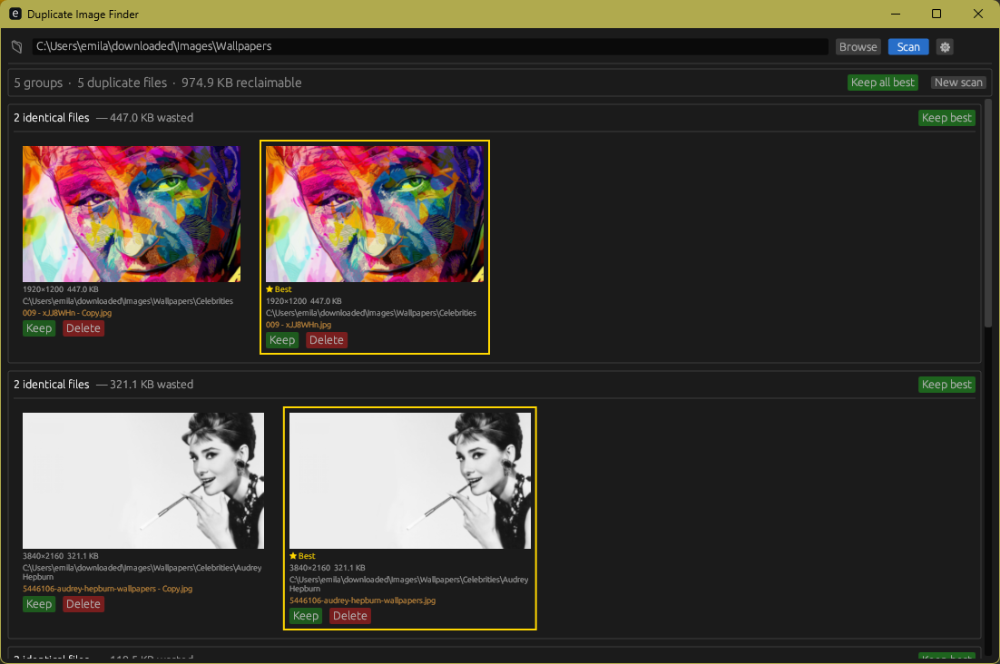

# NeatDisk

A fast Windows desktop app for finding duplicate files, cleaning junk, and understanding what's eating your disk space.



## Features

### Free
| Feature | Description |
|---|---|
| **Duplicate Finder** | Multi-phase scan: size grouping → partial-hash pre-filter → full MD5. Finds exact duplicates across images, videos, documents, audio, archives, or all files. Keeps the highest-resolution copy and previews before you delete. |
| **Large Files** | Lists the 20 largest files in any folder so you can spot what's taking up space. |
| **Junk Cleaner** | One-click removal of temp files (`%TEMP%`, `Windows\Temp`), browser caches (Chrome, Edge, Firefox), Windows Error Reports, and Recycle Bin contents. |
| **Disk Analyzer** | Visual breakdown of disk usage by file category (Images, Videos, Audio, Documents, Archives) and a ranked list of the top 25 heaviest folders. |
| **Empty Folder Finder** | Detects and removes leftover empty directories. |
| **Weekly Scheduler** | Register a Windows Task Scheduler job to auto-scan a folder on a chosen day and time — no admin rights required. |
| **Auto-updater** | Checks GitHub Releases on launch and prompts you when a new version is available. |
| **System Tray** | Minimizes to tray with Show/Hide and Scan Now shortcuts. |

### Pro
| Feature | Description |
|---|---|
| **Similar Image Detection** | Perceptual hashing (dHash) clusters visually similar images — useful for finding near-duplicates, resized copies, and screenshots. Sensitivity is adjustable. |
| **Unlimited Large Files** | Remove the 20-file cap and see every file above your chosen size threshold. |

[Get Pro](https://emiljohansson.info/softwares/neat-disk)

## Download

Grab the latest `.exe` (portable) or `.msi` (installer) from [Releases](https://github.com/p145085/NeatDisk/releases).

**Requirements:** Windows 10 or later, x64.

## Building from source

```
cargo build --release
```

The build requires the `LICENSE_SECRET` environment variable (used to sign and validate Pro license keys). Set it to any non-empty string for local builds; keys generated with a different secret won't validate against the released builds.

```
$env:LICENSE_SECRET = "your-secret-here"
cargo build --release
```

### MSI installer

[cargo-wix](https://github.com/volks73/cargo-wix) and WiX Toolset 3.x must be installed.

```
cargo wix --no-build --nocapture
```

## License

Proprietary. All rights reserved. You may not redistribute or modify this software without written permission.
